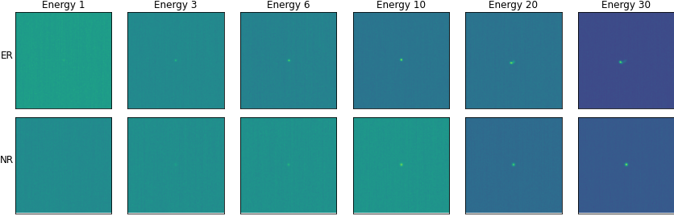

# 🥇 IDAO Squatting Slavs 🏆

- [🥇 IDAO Squatting Slavs 🏆](#-idao-squatting-slavs-)
  - [Data and EDA](#data-and-eda)
  - [Devcontainer](#devcontainer)
    - [Quickstart: local](#quickstart-local)
    - [Quickstart: remote](#quickstart-remote)


## Data and EDA

The original data folder looks like this:

```
idao_dataset
├── private_test
├── public_test
└── train
    ├── ER
    └── NR
```

The classes (type and energy) can be deduced form file names, which are like this

```
-0.9444000124931335__CYGNO_60_40_He_NR_10_keV_930V_30cm_SRIM_IDAO_iso_crop_hist_pic_run4_ev0;1.png
```

The `NR_10` part is what is important. I split this training data into train/val/test on a 90/5/5 split, and additionally create a `test_holdout` folder for those few cases of class combinations that are hardly present in the test set. This is done in the `dev_data.ipynb` notebook. So the new data structure looks like this

```
data
├── test
├── test_holdout
├── train
└── val
```

Here's a few examples of each class:


And here's a matrix showing all combinations




## Devcontainer

### Quickstart: local

This assumes that all your files are on a local machine, where you also want to run the container. If you want to run the container on a remote machine, check out the [remote](#quickstart-remote) section.

All you need to do is to open the repository in VSCode, press <kbd>Ctrl</kbd> + <kbd>Shift</kbd> + <kbd>P</kbd> and type/select "Reopen in Container".

### Quickstart: remote

This instructions are for the following scenario: your files and credentials are on a remote **host** machine (such as an AWS server, desktop workstation), and the only use of your **local** machine is to connect to the host. It is required that you have **the same username** on both local and host machine.

> The same username is required, because it will be used in the name of docker compose project, as well as the docker image. This enables multiple users on the same machine to use development containers without interfering with each other, as they will all have a separate compose project/docker image.

First, you need to set the `docker.host` setting in VSCode on your local machine to point at your host machine - see [here](https://code.visualstudio.com/docs/remote/containers-advanced#_a-basic-remote-example) for instructions. Next, you need to execute the following on both the local and host machine from the root of your repository (this you have to do just once in the lifecycle of the project)

```
echo "COMPOSE_PROJECT_NAME=${PWD##*/}_${USER}" >> .env 
```

Next, execute this from the root of your repository on the host machine

``` 
docker-compose -f .devcontainer/docker-compose.yml up -d
```

You can close the remote terminal after that. Finally, open the repository in VSCode on your local machine, press <kbd>Ctrl</kbd> + <kbd>Shift</kbd> + <kbd>P</kbd> and type/select "Reopen in Container".

This way, everything will work as expected - even the port 8888 of the remote container will be mapped to port 8888 in your local machine.

